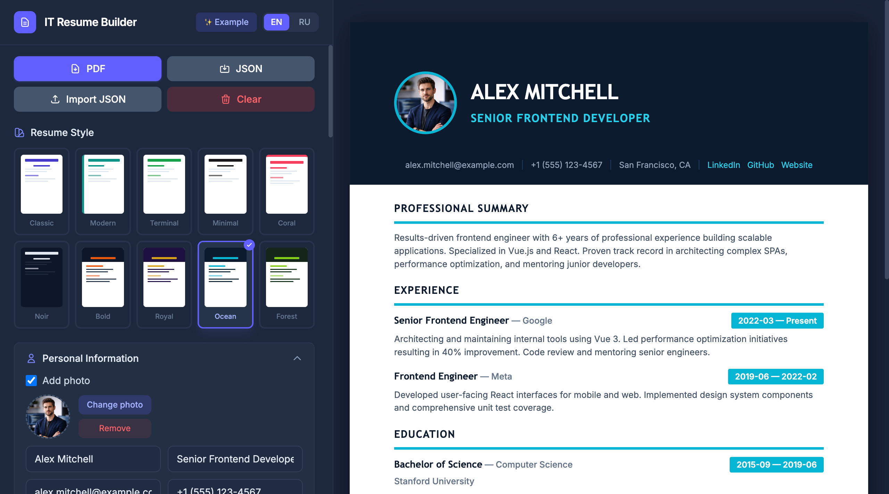

# IT Resume Builder

[](https://vuejs.org/)
[](https://pinia.vuejs.org/)
[](https://vite.dev/)
[](https://tailwindcss.com/)
[](https://github.com/parallax/jsPDF)

> [English version](README.en.md)

Клиентское SPA-приложение для создания, предпросмотра и экспорта IT-резюме в PDF или JSON. Без бэкенда — вся логика (генерация PDF, импорт/экспорт JSON, хранение данных) работает прямо в браузере.

SPA на **Vue 3** (Composition API) + **Pinia** для стейт-менеджмента. 10 встроенных тем оформления, двуязычный интерфейс (RU/EN), адаптивная верстка для десктопа и мобильных.

<p align="center">
  
</p>

---

## Возможности

- **Визуальный редактор** — формы для всех секций резюме: личные данные, опыт, образование, навыки, проекты, языки
- **Live-превью** — мгновенное отображение изменений в формате A4 рядом с редактором
- **10 тем оформления** — Classic, Modern, Terminal, Minimal, Bold, Royal, Noir, Ocean, Coral, Forest
- **PDF-экспорт** — печать через системный диалог (десктоп/iOS) или html2canvas + jsPDF (Android)
- **JSON импорт/экспорт** — сохранение и загрузка данных резюме в формате JSON
- **Фото** — загрузка и обрезка фотографии (cropperjs), отображение в резюме
- **Автосохранение** — данные сохраняются в localStorage; при повторном визите предлагается восстановление
- **Демо-данные** — быстрое заполнение примерами на русском или английском
- **Двуязычный интерфейс** — переключение RU/EN через vue-i18n
- **Адаптивность** — полноценная работа на мобильных устройствах с overlay-превью
- **Drag & Drop** — перетаскивание для изменения порядка секций

---

## Стек технологий

| Слой | Технологии |
|------|-----------|
| Фреймворк | Vue 3 (Composition API), Vue Router 4 |
| Стейт | Pinia 3 |
| Сборка | Vite 8 |
| Стили | Tailwind CSS 4 |
| PDF | html2canvas 1 + jsPDF 4 |
| i18n | vue-i18n 10 |
| Изображения | cropperjs 1, sharp (dev) |

---

## Архитектура

### Поток данных

```
[Формы редактора] ──────────► [Pinia Store] ◄──────── [Компонент превью]
                             (resumeData)             (live-синхронизация)
                                  │
                   ┌──────────────┼──────────────┐
                   ▼              ▼              ▼
             [PDF Export]   [JSON Export]   [JSON Import]
             print / jsPDF   Blob → download  FileReader → store
                   │              │              │
                   ▼              ▼              ▼
              resume.pdf     resume.json    восстановление
                                            данных в store
```

### Единый источник истины

Pinia store (`src/stores/resumeStore.js`) хранит все данные резюме. UI-компоненты реагируют на изменения автоматически. Модификация стейта — только через actions:

```js
// ✅ Правильно
const store = useResumeStore()
store.updateField('personal', newData)

// ❌ Неправильно — прямая мутация
store.personal = newData
```

### PDF-экспорт: кросс-платформенная стратегия

| Платформа | Метод | Результат |
|-----------|-------|-----------|
| Десктоп | `window.open` → `print()` | Векторный PDF, кликабельные ссылки |
| iOS / iPad | `iframe` → `print()` | Системный диалог печати |
| Android | `html2canvas` → `jsPDF` → `navigator.share` | Растровый PDF, шаринг |

### Тематизация

10 тем определены как объекты inline-стилей (`src/themes/index.js`). Inline-стили обязательны для корректного рендеринга через html2canvas.

---

## Структура проекта

```
resume/
├── src/
│   ├── components/
│   │   ├── editor/              # Формы редактора
│   │   │   ├── PersonalInfoForm.vue
│   │   │   ├── SummaryForm.vue
│   │   │   ├── ExperienceForm.vue
│   │   │   ├── EducationForm.vue
│   │   │   ├── SkillsForm.vue
│   │   │   ├── ProjectsForm.vue
│   │   │   ├── LanguagesForm.vue
│   │   │   └── ThemeSelector.vue
│   │   ├── preview/
│   │   │   └── ResumePreview.vue   # HTML-шаблон резюме (источник для PDF)
│   │   └── shared/
│   │       ├── TagInput.vue        # Переиспользуемый ввод тегов
│   │       ├── DraggableList.vue   # Drag-to-reorder
│   │       └── PhotoUpload.vue     # Загрузка и обрезка фото
│   ├── views/
│   │   ├── EditorView.vue          # Левая панель с формами
│   │   └── PreviewView.vue         # Правая панель / превью
│   ├── stores/
│   │   ├── resumeStore.js          # Pinia — все данные резюме
│   │   └── themeStore.js           # Pinia — активная тема
│   ├── themes/
│   │   └── index.js                # 10 тем с inline-стилями
│   ├── utils/
│   │   ├── pdfExport.js            # Кросс-платформенный PDF-экспорт
│   │   └── jsonExport.js           # JSON экспорт/импорт
│   ├── locales/                    # i18n переводы (en.json, ru.json)
│   ├── i18n.js                     # Конфигурация vue-i18n
│   ├── App.vue                     # Корневой компонент
│   └── main.js                     # Точка входа
├── public/
│   ├── favicon.svg
│   └── icons.svg
└── package.json
```

---

## Быстрый старт

### Требования

- Node.js >= 20

### Установка и запуск

```bash
cd resume
npm install
npm run dev
```

Приложение откроется на `http://localhost:5173`.

### Сборка для продакшена

```bash
npm run build
npm run preview    # предпросмотр билда
```

---

## Структура данных резюме

```js
{
  showPhoto: boolean,
  photo: string,              // base64 или URL
  personal: {
    name, title, email, phone, location, linkedin, github, website
  },
  summary: string,
  experience: [{ id, company, position, startDate, endDate, current, description }],
  education: [{ id, institution, degree, field, startDate, endDate }],
  skills: [string],
  projects: [{ id, name, description, tech[], url }],
  languages: [{ id, name, level }]
}
```

Каждый элемент массива имеет `id` (UUID) для уникальной идентификации при добавлении, удалении и сортировке.

---

## Ключевые инженерные решения

| Решение | Почему |
|---------|--------|
| **Inline-стили для тем** | html2canvas не поддерживает внешние CSS классы при рендере — inline обеспечивает идентичный вид в PDF |
| **print() вместо jsPDF на десктопе** | Векторный PDF, кликабельные ссылки, чёткий текст — html2canvas даёт только растровое изображение |
| **jsPDF + share на Android** | Android-браузеры не дают удобного UX для «сохранить как PDF» через print-диалог |
| **localStorage для автосохранения** | Нет бэкенда — данные не теряются между сессиями; диалог восстановления при повторном визите |
| **UUID на клиенте** | `crypto.randomUUID()` — стабильные ID элементов без сервера |
| **Pinia вместо Vuex** | Нативная поддержка Composition API, TypeScript-friendly, проще API |

---

## Roadmap

- [ ] Drag & Drop для перестановки секций резюме
- [ ] Поддержка нескольких страниц PDF
- [ ] Кастомные темы (создание своих цветовых схем)
- [ ] E2E тесты (Playwright)
- [ ] PWA-режим (offline-доступ)
- [ ] Поддержка нескольких резюме (переключение между ними)
- [ ] Шаринг резюме по ссылке

---

## Авторы

**Трепачёв Дмитрий** & **Серенко Роман**
